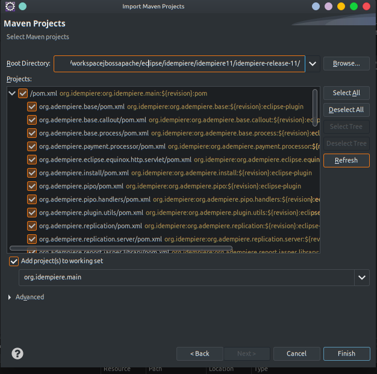

# Setting Up iDempiere Customization Development Environment

## Prerequisites

- Operating System: Windows/Linux/macOS
- Java Development Kit (JDK) 11 or higher
- Eclipse IDE + DBeaver Plugin
- PostgreSQL database
- Git

---- 

## Steps

- [Prerequisites](#prerequisites)
- [Steps](#steps)
  - [1. **Install Java Development Kit (JDK)**:](#1-install-java-development-kit-jdk)
  - [2. **Install Eclipse IDE**:](#2-install-eclipse-ide)
  - [3. **Set up PostgreSQL**:](#3-set-up-postgresql)
  - [4. **Clone iDempiere Repository**:](#4-clone-idempiere-repository)
  - [5. **Import iDempiere Projects into Eclipse**:](#5-import-idempiere-projects-into-eclipse)
  - [6. **Set up Database Connection in Eclipse**:](#6-set-up-database-connection-in-eclipse)
  - [7. **Build iDempiere Projects**:](#7-build-idempiere-projects)
  - [8. **Run iDempiere Server**:](#8-run-idempiere-server)
  - [9. **Start Customization Development**:](#9-start-customization-development)
  - [10. **Version Control**:](#10-version-control)
- [Conclusion](#conclusion)


----

### 1. **Install Java Development Kit (JDK)**:
   - Download and install JDK from the official Oracle website or use a package manager like `apt`, `brew`, or `yum`.
   - Set the JAVA_HOME environment variable to the JDK installation directory.
   - Visit [Oracle Website for downloading]([https://](https://download.oracle.com/java/17/latest/jdk-17_windows-x64_bin.zip))

### 2. **Install Eclipse IDE**:
   - Download Eclipse IDE for Java EE Developers from the official website. Visit Eclipse.org for downloading Eclipse Java EE Developer 2023-12 version. [Eclipse.org]([https://](https://mirror.kakao.com/eclipse/technology/epp/downloads/release/2023-12/R/eclipse-jee-2023-12-R-win32-x86_64.zip))
   - Extract the downloaded archive and run Eclipse.


### 3. **Set up PostgreSQL**:
   - Download and install PostgreSQL database from the official website [PostgreSQL Website]([https://](https://get.enterprisedb.com/postgresql/postgresql-15.6-1-windows-x64.exe)). 
   - Configure PostgreSQL by creating a new database and user for iDempiere.
   - Note down the database name, username, and password for later use.

### 4. **Clone iDempiere Repository**:
   - Open terminal/command prompt.
   - Navigate to the directory where you want to store iDempiere source code.
   - Execute the following command to clone the iDempiere repository:
     ```bash
     git clone https://github.com/idempiere/idempiere.git
     ```


### 5. **Import iDempiere Projects into Eclipse**:
   - Open Eclipse IDE.
   - Go to File -> Import -> Existing Projects into Workspace.
   - Browse to the directory where you cloned iDempiere repository and import the projects.




----

### 6. **Set up Database Connection in Eclipse**:
   - In Eclipse, go to Window -> Show View -> Data Source Explorer.
   - Right-click on Database Connections and select New.
   - Choose PostgreSQL from the list and enter the database connection details (URL, username, password).
   - Test the connection and save it.
   - If using DBeaver, install DBeaver plugin by Update site URL: https://dbeaver.io/update/latest/ (Multiplatform) go to Help -> Eclipse Marketplace -> put `dbeaver` as search key, after shown in list, click `Install` and `Finish`. 
  
 

----

### 7. **Build iDempiere Projects**:
   - Right-click on the iDempiere project in Eclipse.
   - Select Run As -> Maven build.
   - In the goals field, enter `install` and click Run.
   - When there are errors, use target platform for IDempiere project. Open project `org.idempiere.p1.targetplatform`, click on file `org.idempiere.p2.targetplatform.target` will show following editor, and click `Set as Target Platform` link in right-upper corner. 
   - 


----

### 8. **Run iDempiere Server**:
   - Navigate to the directory where iDempiere is cloned.
   - Run the following command to start the server:
     ```bash
     ./idempiere-server/startup.sh
     ```
   - Access iDempiere application via web browser using the configured URL (usually http://localhost:8080).


----


### 9. **Start Customization Development**:
   - Now you have a running iDempiere instance and can start developing customizations.
   - Use Eclipse for coding, debugging, and testing your customizations.
   - Deploy your customizations to the running iDempiere server for testing.


----

### 10. **Version Control**:
    - Use Git for version control of your customization code.
    - Commit changes regularly and push them to your repository.

----

## Conclusion

You now have a fully functional development environment set up for iDempiere customization. Start developing and enhancing iDempiere according to your project requirements.
